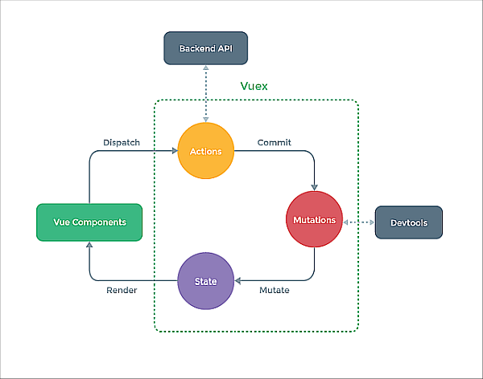

# Vuex によるグローバルステート管理

[**Vuex**](https://next.vuex.vuejs.org/ja/index.html)は、アプリーケーション内の複数のページにまたがって利用されるステート（データ）を集中的に管理するためのプラグインだ。データの流れを明確にカテゴリー分けして整合性を保証している。（**Facebook** の **Flux**, **Redux** のアイデアを Evan さんがパクった？いや参考にしたもの。）

**Vue3**対応の**Vuex**はバージョン 4 以降となる。
Vuex は TypeScript との相性があまりよくないということが言われてきたが、 Veux4 はいかに？



## Vuex の主な要素

上の概念図の緑の点線に含まれるものが Vuex だが、そこに次のキーワードがある。また実際のコードでもそれらのキーワードをもとに構成される。

### State

State はアプリケーションが扱うデータであり、アプリケーションの状態を示す。

### Actions

Actions はコンポーネントから呼び出され、mutation を通じて state を更新する。
必要に応じて WebAPI などの非同期の処理も行う。

### Mutations

state の更新を行う。mutation はいっさい非同期の処理は行わない。

## インストール

**Vue-cli** で **Vuex** を選択した場合は、Vue のバージョンに合う Vuex がインストールされ、初期化データが格納される。**Vite** でプロジェクトを作成した場合は自分でインストールする。

npm の場合

```shell
npm install vuex@4 --save
```

yarn の場合

```shell
yarn add vuex@4
```

## ストアの作成

**Vue-cli** で開始した場合は以下のソース src/store/index.js が作成される。**Vite** で開始したときはまず以下のソースを作成する。

```js
import { createStore } from "vuex"

export default createStore({
  state: {},
  mutations: {},
  actions: {},
  modules: {}
})
```

**Vue3** では、やはり vue から **createStore** 関数をインポートしてそれを使ってストアを作成している。
ストアオブジェクト初期化の引数の中に、Vuex の主要なキーワードをキーとするオブジェクトがあることが見てとれる。modules は、Vuex の各データを分割して格納するためのもの。

## Vuex の有効化

Vuex の有効化はやはりエントリーポイントファイルの **main.js** で行われる。このファイルも Vite で開始したときは、以下のように書き換える。

```js
import { createApp } from "vue"
import App from "./App.vue"
import store from "./store" // <-- ここ
createApp(App).use(store).mount("#app")
```

Vue のインスタンスは src/store/index.js から返されたインスタンスを取り込んでいる。

## ミニマルな構成

Vuex の仕組みを必要最低限のもので利用するときは以下のようなる。

### ミニマルなストア

src/store/index.js を以下の内容で作成する。

```js
import { createStore } from "vuex"
const store = createStore({
  state: {
    users: []
  }
})
```

ここでは[]で初期化されたステート users が定義されている。

### コンポーネントからのストアの参照

ストアを参照するときは、**vuex** から **useStore** 関数を import し、**vue** から **computed** 関数を import する。

```js
<script>
import { computed } from "vue"
import { useStore } from "vuex"
export default {
  setup() {
    const store = useStore()
    const users = computed(() => store.state.users)
    const count = computed(() => store.state.users.length)
    const addUser = () =>
      store.commit("addUser", { user: "user" + count.value })

    return {
      users,
      count,
      addUser
    }
  }
}
</script>
```

Vue3 の Vuex4 では、setup 関数内で useStore 関数を実行し、ストアオブジェクト store を取得する。
ストアのデータを取得（参照）するときは、computed 関数を使いリアクティブ性を担保する。

```js
const store = useStore()
const users = computed(() => store.state.users)
```

### ストアデータの更新

Vuex では、state データを直接編集できない。というかわざわざ直接編集できない仕組みにしている。mutations に定義された関数からのみデータの更新は許される。

```js
  mutations: {
    addUser(state, payload) {
      state.users.push(payload.user)
    }
  }
```

mutation 関数の第１引数は必ず state でなければならない。上の例の addUser 関数では、第１引数は state で第２引数は更新用オブジェクト payload になっている。

コンポーネントから mutation 関数を呼び出すには、store オブジェクトの commit メソッドを使う。

```es6
const addUser = () => store.commit("addUser", { user: "user" + count.value })
```

この関数は、store の commit メソッド実行する。第１引数は mutation 関数名で、第２引数は更新用オブジェクトになっている。

### setup 内のもうひとつの記法

[Vuex4 本家のページ](https://next.vuex.vuejs.org/ja/guide/composition-api.html#%E3%82%B9%E3%83%86%E3%83%BC%E3%83%88%E3%81%A8%E3%82%B2%E3%83%83%E3%82%BF%E3%83%BC%E3%81%B8%E3%81%AE%E3%82%A2%E3%82%AF%E3%82%BB%E3%82%B9)を見たところ、setup 関数内の記述法があった。

```js
export default {
  setup() {
    const store = useStore()
    return {
      users: computed(() => store.state.users), // OK
      count: computed(() => store.state.users.length), // NG
      addUser: () => store.commit("addUser", { user: "user" + count.value }) // OK
    }
  }
}
```

こっちのほうが簡潔に書けて良さそうだ。ところが、上記の count だけはエラーになってしまった。エラーの原因が判明したらこちらの記法を使いたい。

以上
